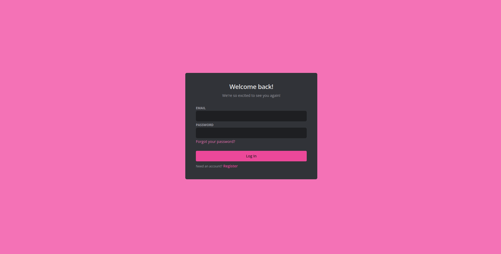
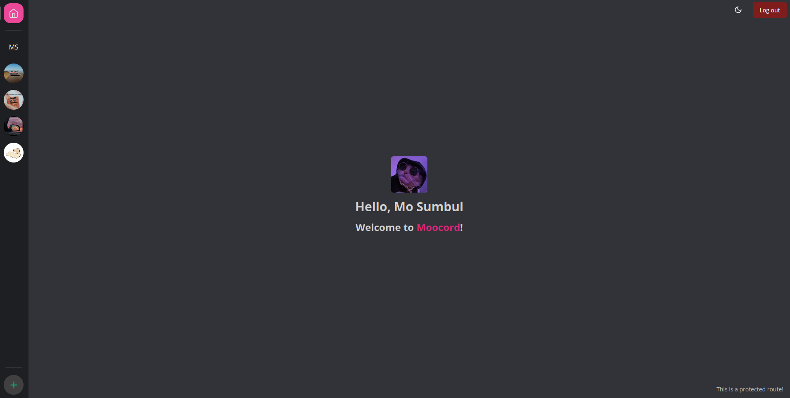
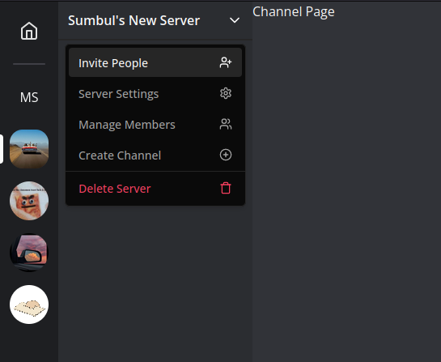

# Moocord

A fully featured Discord clone built with Next.js & Supabase(Auth & PostgreSQL database).

Join servers and chat with the members! Text, Voice and Video channels coming soon!

Currently available features:
- Create Account and login
- Create servers customizable with name and icon
- Add gifs as server icons
- Invite other users to your server
- Join servers with invite url or invite code
- Light and dark themes

## Live Preview

You can find the live app at - [moocord.vercel.app](https://moocord.vercel.app/)

## Preview







## Features to be be added

These are the features I am currently working on to add to the project

- [ ] Edit Server Name and Icon
- [ ] Realtime chat
- [ ] Ability to create channels
- [ ] Ability to leave servers
- [ ] Manage member role and remove members from
- [ ] Ability to delete servers
- [ ] Ability to delete messages
- [ ] Ability to edit messages
- [ ] Upload files(images & pdf) to chat
- [ ] Voice Channels
- [ ] Video Channels
- [ ] Search for members
- [ ] Direct message other users

## Running locally

1. clone this repository

```bash
git clone git@github.com:sandeepdotcode/moocord.git && cd moocord
```
2. Install the dependencies (remove bun.lockb file if not using bun)
```bash
bun install
# or
npm install
```

3. Run the development server:

```bash
npm run dev
# or
yarn dev
# or
pnpm dev
# or
bun run dev
```

Open [http://localhost:3000](http://localhost:3000) with your browser to see the result.

This is a [Next.js](https://nextjs.org/) project bootstrapped with [`create-next-app`](https://github.com/vercel/next.js/tree/canary/packages/create-next-app).
